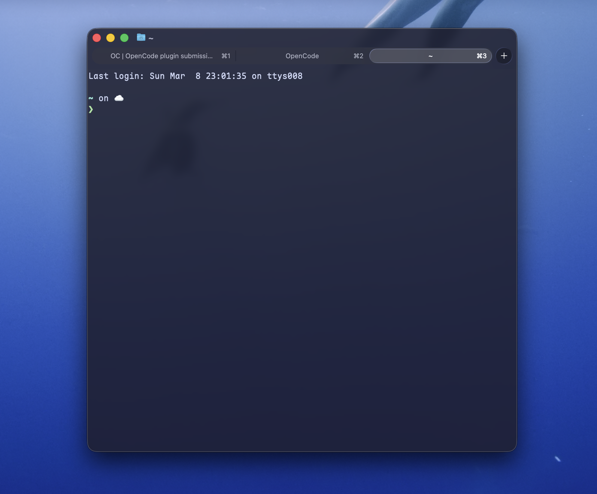
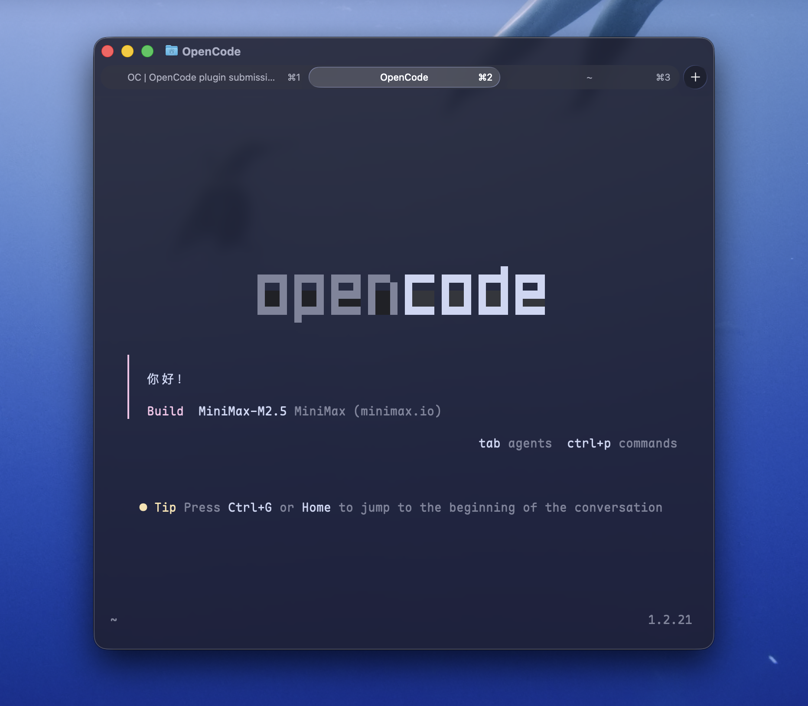

# Aesthetic Terminal Setup 🎨

一套完整的终端美化配置方案，为 Ghostty 终端和 OpenCode AI 助手提供统一的主题风格。


[](https://github.com/jqlong17/homebrew-cora-theme)

## 🚀 快速安装（推荐）

一行命令搞定全套配置：

```bash
brew tap ruska/cora-theme && brew install cora-theme && cora-theme-install
```

安装后重启 Ghostty 和 OpenCode 即可享受美观的终端主题！

## ✨ 效果预览

<table>
  <tr>
    <td align="center">
      
      <br/>
      <sub>Ghostty 终端 - 磨砂玻璃质感</sub>
    </td>
    <td align="center">
      
      <br/>
      <sub>OpenCode AI 助手 - 透明主题</sub>
    </td>
  </tr>
</table>

- 🧊 **磨砂玻璃质感**：半透明背景配合 macOS 原生模糊效果
- 🎨 **Catppuccin Mocha 主题**：柔和的紫粉色调，护眼的深色主题
- 🔤 **优雅的编程字体**：Maple Mono 连字体 + 苹方中文字体
- 🔄 **统一风格**：Ghostty 和 OpenCode 视觉完全一致

## 🚀 快速开始

### 方式一：AI 自动安装（推荐）

将本仓库地址提供给 AI 助手，AI 将自动完成所有配置：

```
https://github.com/YOUR_USERNAME/aesthetic-terminal-setup
```

AI 会执行：
1. 下载并安装 Maple Mono 字体
2. 配置 Ghostty 终端主题
3. 配置 OpenCode 主题
4. 验证安装效果

### 方式二：手动安装

#### 1. 安装依赖

**Ghostty 终端**
```bash
brew install --cask ghostty
```

**OpenCode**
```bash
brew install opencode
```

**Maple Mono 字体**
```bash
brew tap subframe7536/maple-font
brew install --cask maple-mono
```

#### 2. 应用配置

复制配置文件到对应位置：

```bash
# Ghostty 配置
cp configs/ghostty.config ~/Library/Application\ Support/com.mitchellh.ghostty/config

# OpenCode 主题
mkdir -p ~/.config/opencode/themes
cp configs/catppuccin-mocha.json ~/.config/opencode/themes/
cp configs/tui.json ~/.config/opencode/
```

#### 3. 重启应用

- Ghostty: 按 `Command + Shift + ,` 刷新配置
- OpenCode: 输入 `/exit` 退出后重新打开

## 📁 仓库结构

```
.
├── README.md                    # 本文件
├── skill.md                     # AI Skill 文件（完整配置指南）
├── configs/
│   ├── ghostty.config          # Ghostty 配置文件
│   ├── catppuccin-mocha.json   # OpenCode 主题定义
│   └── tui.json                # OpenCode TUI 配置
└── assets/
    └── preview.png             # 效果预览图（可选）
```

## 🎨 颜色方案

### Catppuccin Mocha 调色板

| 颜色 | Hex | 用途 |
|------|-----|------|
| Base | `#1e1e2e` | 背景色 |
| Text | `#cdd6f4` | 文字色 |
| Pink | `#f5c2e7` | 强调色、关键字 |
| Mauve | `#cba6f7` | 主要强调色 |
| Lavender | `#b4befe` | 链接、变量 |
| Peach | `#fab387` | 数字、斜体 |
| Green | `#a6e3a1` | 字符串、成功状态 |
| Blue | `#89b4fa` | 函数、信息 |

## ⚙️ 配置详情

### Ghostty 配置亮点

```ini
# 磨砂玻璃效果
background-opacity = 0.85
background-blur-radius = 20

# 主题
theme = Catppuccin Mocha

# 字体
font-family = Maple Mono
font-family = PingFang SC
font-size = 14
```

### OpenCode 配置亮点

```json
{
  "theme": "catppuccin-mocha",
  "background": "none"  // 透明背景，继承终端效果
}
```

## 🔧 自定义调整

### 调整透明度
编辑 Ghostty 配置：
```ini
background-opacity = 0.75  # 更透明
background-blur-radius = 30 # 更模糊
```

### 调整字体大小
```ini
font-size = 16  # 更大字体
```

### 调整颜色强度
编辑 `configs/catppuccin-mocha.json` 中的颜色定义

## ❓ 常见问题

### Q: OpenCode 背景不透明？
A: 确保：
1. 使用了正确的 TUI 配置文件路径 `~/.config/opencode/tui.json`
2. 主题文件在 `~/.config/opencode/themes/catppuccin-mocha.json`
3. 完全重启 OpenCode（不是刷新）

### Q: 字体显示不正确？
A: 确认 Maple Mono 已安装：
```bash
fc-list | grep -i maple
```
如未安装，运行 `brew install --cask maple-mono`

### Q: 磨砂玻璃效果不明显？
A: 增加模糊半径：
```ini
background-blur-radius = 30
```

## 📝 依赖说明

- **操作系统**: macOS（Windows/Linux 可能部分功能不支持）
- **终端**: Ghostty 1.0+
- **AI 助手**: OpenCode 最新版
- **字体**: Maple Mono + PingFang SC（苹方）

## 🤝 分享

如果你想将这套配置分享给他人：

1. **分享给朋友**：直接发送本仓库链接
2. **分享给 AI**：提供 skill.md 文件内容或本仓库地址
3. **分享截图**：使用 `#aesthetic-terminal-setup` 标签

## 📄 许可证

MIT License - 自由使用、修改和分享

## 🙏 致谢

- [Ghostty](https://ghostty.org) - 优秀的终端模拟器
- [OpenCode](https://opencode.ai) - 强大的 AI 编程助手
- [Maple Mono](https://github.com/subframe7536/maple-font) - 优美的编程字体
- [Catppuccin](https://github.com/catppuccin/catppuccin) - 精致的配色方案

---

**制作**：ruska  
**日期**：2026-03-08  
**版本**：1.0.0
